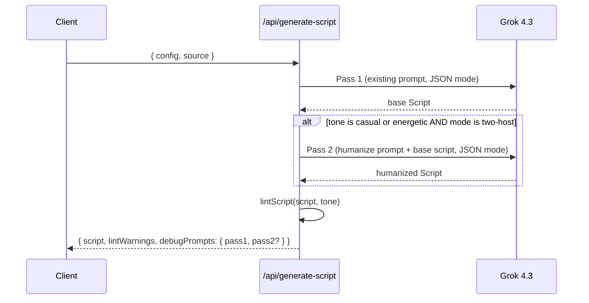

# P8 — Conversational two-pass generation

Working brief for NotebookLM-style script humanization (two-pass Grok generation + audio/lint adjustments). Copy of the implementation plan for offline reference.

---

## Architecture



Pass 1 stays focused on **content**: what gets covered, in what order, with what argument structure. Pass 2 is a narrowly-scoped **transformation**: split long turns, add reaction turns, weave in speech tags, drop in em-dash interruptions. Same speaker assignments for substantive points, same overall arc, no new facts.

The split matters because today the single prompt is doing both jobs and compromising on each. NotebookLM-feel comes from texture density, which is what a dedicated pass produces.

## What's in scope

- New `humanize` prompt + server endpoint + xAI helper
- Auto-wire pass 2 into `/api/generate-script` for casual/energetic two-host
- Re-humanize button on the editor sidebar (manual re-run, with confirm)
- Variable inter-turn pause: micro-turns get ~100ms instead of 350ms
- Lint relaxation for casual/energetic (more tags allowed before warning)
- Source screen spinner copy updated to reflect the longer two-pass flow

## What's out of scope

- Streaming pass-1-then-pass-2 progress to the client (just one combined spinner; total ~60s)
- Diff view between pass 1 and pass 2 output
- Per-turn humanize hint (could add later, like the regenerate-turn hint)
- Solo-mode humanization (the dynamic is fundamentally different — defer)

---

## 1. Humanize prompt — `server/src/prompts/humanize.ts` (new)

The heart of the plan. The prompt has three sections:

**a) Role + non-negotiables**

```
You are revising an existing podcast script to make it sound more like
a real, flowing two-host conversation. Think NotebookLM-style banter.

DO NOT change the meaning, the substantive claims, or which speaker
makes each substantive point. The goal is texture, not content.

DO NOT shorten the script overall — adding reactions and splitting
long turns will make it longer, that's expected.

DO NOT invent new facts, statistics, or examples. Only restructure
and add conversational glue.

You will receive a script. Return a JSON object in the SAME schema
with restructured turns. Renumber turn IDs t1, t2, ... in the new
sequential order.
```

**b) The transformations (concrete and operational)**

```
Apply these in proportion to how casual the tone is:

1. SPLIT long turns. A 4-sentence turn often becomes 2-3 turns with
   the other host inserting a brief acknowledgement in the middle.

2. INSERT reaction turns. 1-5 word interjections expressing genuine
   listening: "Right.", "Huh.", "Wait, really?", "[chuckle] Yeah.",
   "Mm-hm.", "[pause] Okay.". At least 25% of turns should be
   reactions in casual mode.

3. WEAVE IN speech tags where they would naturally happen — not
   sprinkled as decoration. Tags belong:
   - On reaction turns ([chuckle], [laugh], [sigh])
   - Mid-turn before a pivot ([pause])
   - On the one word in a sentence that carries the meaning
     (<emphasis>that</emphasis> word)
   - On a slowed-down punchline (<slow>...</slow>)
   The supported set is the standard Grok TTS list.

4. EM-DASH INTERRUPTIONS. Trail off with an em-dash, let the other
   host complete the thought:
     A: So the bet isn't really on the—
     B: —model. Yeah, exactly.
   Use 1-2 of these per ~10 turns. Don't overdo it.

5. ALLOW micro-stutters and self-corrections in casual mode:
     "It's not — well, it kind of is, but..."
   Not on every turn. Just enough that it doesn't sound like read aloud.
```

**c) One full before/after example**

A ~6-turn beat, before → after, demonstrating all five transformations on a chunk of plausible podcast content. Few-shot beats verbal description for this kind of pattern matching.

The user message contains the source script formatted as JSON (the model is being asked to transform, so structured input is fine), the tone, and the audience.

---

## 2. New endpoint — `server/src/routes/humanizeScript.ts` (new)

```ts
POST /api/humanize-script
Body: { script: Script, config: ProjectConfig }
Returns: { script: Script, debugPrompt: { system, user } }
```

Reuses `generateScript()` from `server/src/lib/xaiClient.ts` (JSON mode, same model, same parsing). No new xAI helper needed — the wire format is identical.

Wired in `server/src/index.ts` under the same rate limiter as the other expensive endpoints.

---

## 3. Wire pass 2 into the main generation flow

In `server/src/routes/generateScript.ts`, after the existing `generateScript(...)` call:

```ts
let script = baseScript;
let humanizeDebugPrompt;
const shouldHumanize =
  body.config.mode === "two-host" &&
  (body.config.tone === "casual" || body.config.tone === "energetic");
if (shouldHumanize) {
  const result = await humanizeScript(baseScript, body.config);
  script = result.script;
  humanizeDebugPrompt = result.debugPrompt;
}
const lintWarnings = lintScript(script.turns, body.config.tone);
res.json({
  script,
  lintWarnings,
  debugPrompts: {
    pass1: { system: systemPrompt, user: userMessage },
    ...(humanizeDebugPrompt ? { pass2: humanizeDebugPrompt } : {}),
  },
});
```

`shared/types.ts` gets:

```ts
export interface HumanizeScriptRequest { script: Script; config: ProjectConfig; }
export interface HumanizeScriptResponse { script: Script; debugPrompt: { system: string; user: string }; }
// And:
export interface GenerateScriptResponse {
  script: Script;
  lintWarnings?: LintWarning[];
  debugPrompts?: { pass1: { system: string; user: string }; pass2?: { system: string; user: string } };
  // Keep the old debugPrompt field for back-compat — or rename and update the editor.
}
```

The editor's existing `DebugPromptPanel` (`client/src/routes/EditorScreen.tsx`) needs a small update to show two collapsible sections (Pass 1 / Pass 2) when both are present.

---

## 4. Lint relaxation for casual/energetic

`server/src/lib/scriptLinter.ts` — `lintScript` gets a `tone` parameter. New rule for the tag-count check:

```ts
const isLooseTone = tone === "casual" || tone === "energetic";
const cap = isLooseTone ? 5 : 3;
const isClutter = isLooseTone
  ? total > cap && turn.text.length > 30   // only warn if tags are clutter on a substantive turn
  : total > cap;
if (isClutter) { /* warn */ }
```

The intent: a 4-word reaction turn like `[chuckle] Wait, [laugh] really?` carries 2 tags in 4 words and that's *the entire point* of the turn, not a smell. Today's linter would flag it; under the new rule it's fine because the turn is short.

The unclosed-tag and unknown-tag checks stay strict for all tones.

---

## 5. Variable inter-turn pause — `client/src/lib/audio/render.ts`

Replace the current pause selection:

```ts
const sameSpeaker = trimmed[i].turn.speaker === trimmed[i + 1].turn.speaker;
const cur = trimmed[i].turn;
const nxt = trimmed[i + 1].turn;
const isMicro = (t: Turn) => {
  const stripped = t.text.replace(/\[[a-z-]+\]|<\/?[a-z-]+>/gi, "").trim();
  return stripped.split(/\s+/).filter(Boolean).length <= 5;
};
const ms = isMicro(cur) || isMicro(nxt)
  ? 100
  : sameSpeaker
    ? config.pauseSameSpeakerMs
    : config.pauseSpeakerSwitchMs;
segments.push(silence(ms, sampleRate));
```

The micro-turn detector strips speech tags before counting words, so `[chuckle] Yeah.` correctly counts as 1 word, not 2. The 100ms threshold is fixed (not user-tunable) — it's about TTS frame boundaries, not creative preference.

This is the single biggest "feels like NotebookLM" change at the audio layer. Without it, all the new "Right." and "Yeah." reactions land 350ms after the previous turn — which sounds like polite pauses instead of interjections.

---

## 6. Re-humanize button — `client/src/routes/EditorScreen.tsx`

In the sidebar, below the existing Swap All A↔B button, conditionally rendered when `config.mode === "two-host"` and tone is casual or energetic:

- Click shows a confirm panel (same pattern as Swap All): "This will rewrite every turn. All cached audio will be invalidated. Continue?"
- Confirm calls `humanizeScriptApi({ script, config })`, replaces script via `setScript()` (which already clears `turnRenders` and `finalAudioUrl`)
- Error states reuse the existing failure-toast pattern in the sidebar

Also on `client/src/lib/grokClient.ts`:

```ts
export async function humanizeScriptApi(args: { script: Script; config: ProjectConfig }): Promise<{ script: Script; debugPrompt: { system: string; user: string } }>;
```

---

## 7. Source screen spinner copy

`client/src/routes/SourceScreen.tsx` — for casual/energetic, generation now takes ~60s instead of ~30s. Update copy:

```tsx
{config.tone === "casual" || config.tone === "energetic"
  ? "Writing + humanizing script (~60s)…"
  : "Generating script (~30s)…"}
```

Tiny change, sets expectation. The two passes happen back-to-back on the server so we don't need streaming progress.

---

## Files touched

**New:**

- `server/src/prompts/humanize.ts`
- `server/src/routes/humanizeScript.ts`

**Modified:**

- `shared/types.ts` — request/response types, debugPrompts shape
- `server/src/routes/generateScript.ts` — wire pass 2 + tone-aware lint
- `server/src/lib/scriptLinter.ts` — tone parameter
- `server/src/index.ts` — register `/api/humanize-script`
- `client/src/lib/grokClient.ts` — `humanizeScriptApi`
- `client/src/lib/audio/render.ts` — variable pause
- `client/src/routes/EditorScreen.tsx` — Re-humanize button, dual debug panel
- `client/src/routes/SourceScreen.tsx` — spinner copy
- `client/src/store/projectStore.ts` — minor: store `debugPrompts` shape (or keep `debugPrompt` for back-compat and add separate `humanizeDebugPrompt`)

## Suggested commit sequence

1. Server: humanize prompt + endpoint + xAI wiring (no client wiring; can be tested via curl)
2. Server: wire pass 2 into `/api/generate-script` + tone-aware lint
3. Shared types + client API + EditorScreen dual debug panel + Re-humanize button
4. Client: variable inter-turn pause in `render.ts`
5. Client: SourceScreen spinner copy
6. Verify: generate one casual episode, listen, eyeball turn density / tag distribution / pause feel

Total ~3 hours, dominated by prompt iteration in step 1.

## Risk + mitigations

- **Pass 2 hallucinates new facts.** Real risk if the prompt is loose. The "DO NOT invent new facts" rule is non-negotiable in the prompt and reinforced with "only restructure existing content." If we see drift, add a JSON validation pass that compares character-for-character coverage of named entities between the two scripts.
- **Pass 2 returns the same script unchanged.** Less likely than the inverse, but possible if the model decides the input is already conversational enough. Mitigation: the prompt example shows substantial restructuring, which biases against passthrough.
- **Latency feels long.** ~60s round-trip in casual mode is at the edge of acceptable for a "click and wait" interaction. The spinner copy fix sets expectations. If it gets complaints, the next move is server-sent events with two-stage progress — but defer until measured.
- **Renumbered IDs break the editor's persisted state.** The editor uses `turn.id` as the key. After humanize, IDs are all new (`t1`, `t2`, ... in new order). `setScript()` already clears `turnRenders`, which is correct — old cached audio is invalid anyway since the text changed. Verify nothing else references stale IDs.

---

## Implementation checklist

Use this if tracking work outside Cursor:

| Step | Task |
|------|------|
| 1 | Write `server/src/prompts/humanize.ts` (role, transformations, few-shot example) |
| 2 | Add `POST /api/humanize-script` + register in `server/src/index.ts` |
| 3 | Update `shared/types.ts` |
| 4 | Wire pass 2 in `generateScript.ts`; pass tone to `lintScript` |
| 5 | Tone-aware tag cap in `scriptLinter.ts` |
| 6 | `humanizeScriptApi` + store + EditorScreen (debug panels, Re-humanize) |
| 7 | Variable pause in `render.ts` |
| 8 | Spinner copy on `SourceScreen.tsx` |
| 9 | End-to-end smoke test (casual two-host) |

---

## Additional design rationale (for implementers / handoff)

This section records informal reasoning that did not fit cleanly into the mechanical plan above. Another LLM or engineer picking this up should read it before coding—prompt shape and iteration matter more than API plumbing.

### Why two-pass instead of only tightening the Casual tone prompt?

The existing production prompt already encourages conversation; what feels “NotebookLM-like” is **texture density**: short reaction turns, interruptions, tags used as performance rather than decoration. Asking one model call to both **cover the source faithfully** and **perform aggressive restructuring** splits attention. Two passes separate concerns:

- **Pass 1:** substance, ordering, which speaker owns which argument (same as today).
- **Pass 2:** transformation only—splitting, reactions, tags, em-dash beats—without inventing new claims.

When script-gen cost is negligible, the extra latency (~second Grok round-trip) is acceptable; the win is sharper prompts per stage.

**Fallback if two-pass feels flaky:** strengthen Casual-only instructions in `builder.ts` (few-shot beat, explicit micro-turn quota). Ship two-pass first; single-pass is the rollback story.

### Temperature (optional knob not wired in the mechanical plan)

Consider **tone-dependent `temperature`** on the chat completion call in `xaiClient.ts` (or separate values for pass 1 vs pass 2):

- Casual / Energetic humanize: slightly higher (e.g. 0.90–0.95 on pass 2) for more spontaneous reactions.
- Professional / Documentary pass 1: lower (e.g. 0.65–0.75) for tighter structure.

If pass 2 feels same-y or too chaotic, tune temperature before rewriting the whole humanize prompt.

### What “overlap” can and cannot mean here

True **simultaneous overlapping speech** (two voices talking over each other in one acoustic moment) is **not** achievable with the current architecture: Grok TTS is one voice per request, stitching is sequential PCM with gaps. NotebookLM-style “overlap” is usually **rapid alternation**—very short turns, short gaps, trailing-off intonation (em-dash), maybe a `[chuckle]` on the reaction—so it *sounds* interrupt-y without multi-track mixing.

The **variable micro-turn pause (~100 ms)** in `render.ts` is essential for that illusion. Humanizing the script without shortening pauses between short turns will still sound “polite turn-taking,” not banter.

### Cost and latency even when dollars don’t matter

More turns ⇒ roughly **linear increase in TTS cost** and **render time** (parallelism caps at 4). That may still be fine; just surface it in UI copy or stats if users hit long renders. Pass 2 also increases **script generation time** (~2× round-trips for casual/energetic)—hence the spinner copy change.

### Voice casting

Short reaction lines (“Yeah.” “Right.”) sound natural or stiff depending on voice. Defaults **Eve + Ara** fit conversational texture; **Rex / Leo** can sound odd on micro-turns. Consider a one-line hint in the UI for Casual/Energetic (“Voices tuned for banter: Eve & Ara”)—optional polish.

### Why Casual **and** Energetic get humanize, but not Professional / Documentary

Energetic shares the same “fast banter” affordance as Casual; Professional and Documentary are intentionally **measured**—running pass 2 risks undermining pacing and authority. Solo mode is excluded because the interaction pattern is narrator monologue, not two-host interruption (different prompt family).

### Lint relaxation is coupled to humanize

Without raising the tag cap for loose tones (or only warning when `length > 30`), the editor will show amber warnings constantly on dense reaction turns—undermining trust. Implement **lint + humanize + micro-pause** together for perceived quality.

### Prompt iteration budget

Most of the “does it feel like NotebookLM?” outcome is **pass 2 prompt quality** (few-shot example, explicit quotas, banned drift into new facts). Budget **iteration time** there—generate scripts, read aloud, adjust wording—before adding features (diff view, SSE progress, etc.).

### Client backward compatibility

If anything still expects `debugPrompt` as a single object, either:

- Return **both** `debugPrompt` (alias to pass1) and `debugPrompts`, or  
- Update **SourceScreen**, **EditorScreen**, and **projectStore** in one pass so nothing reads stale keys after persist/rehydrate.

### Testing order

1. Curl `POST /api/humanize-script` with a saved JSON script until output shape is stable.  
2. Wire into `generate-script`.  
3. Then client UI.  

Avoid debugging prompt + React state + audio at once.

### Related docs

- [`NEXT_STEPS_1.md`](NEXT_STEPS_1.md) — historical phase roadmap (P0–P7 complete).  
- [`docs/PodcastForge_Build_Plan_v0.1.md`](docs/PodcastForge_Build_Plan_v0.1.md) — original product/spec context if prompts need to align with broader constraints.
