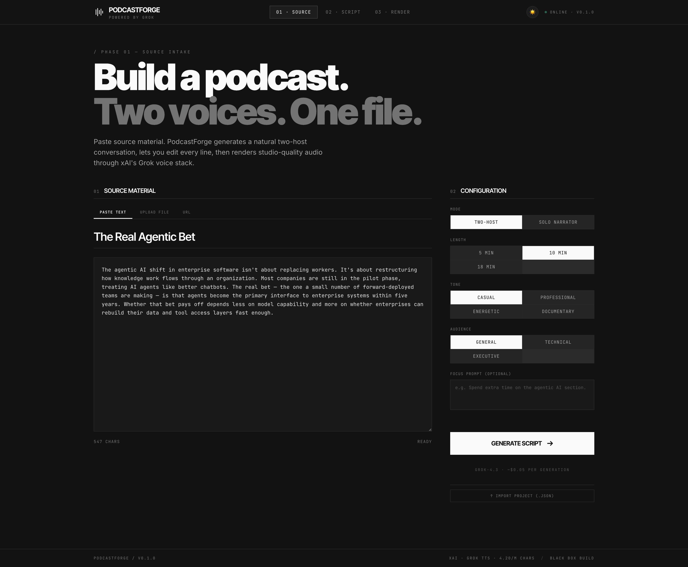
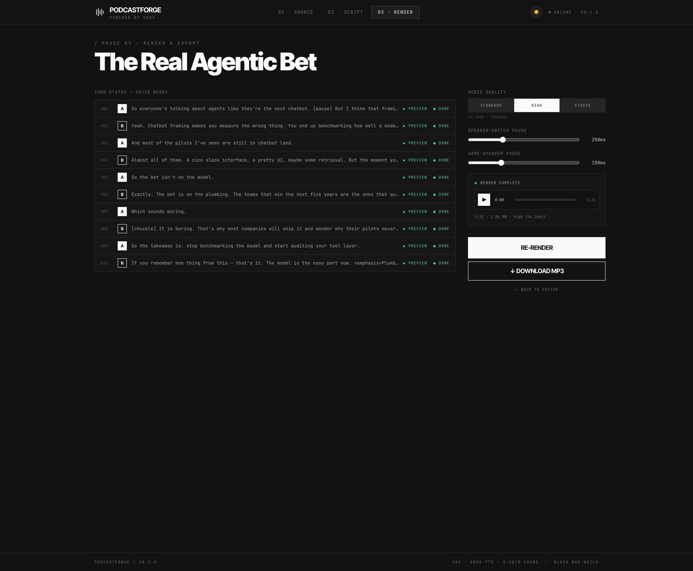

# PodcastForge

> NotebookLM-style podcast generator on the xAI Grok stack.
> Paste source material → editable two-host (or solo) script → studio-quality MP3.



---

## What it does

PodcastForge turns any text source (paste, PDF, DOCX, or URL) into a finished podcast episode in three steps:

1. **Source.** Pick a length, tone, audience, and mode. Drop in your material.
2. **Script.** Grok 4.3 writes a natural conversation. You edit any line, regenerate any turn with an AI hint, override per-turn voices, insert / move / duplicate / delete turns, swap host A↔B, or import/export the project as JSON.
3. **Render.** Each turn is synthesized via Grok TTS in parallel (concurrency 4), trimmed of trailing silence, stitched with configurable inter-turn pauses, and encoded to a single MP3 you can preview or download.

The whole thing runs locally — Vite dev server at `:5173`, Express proxy at `:8787`. Your xAI API key never leaves the server.

---

## Screens

### 01 — Source


Paste text, upload a `.pdf` / `.docx` / `.txt` / `.md` (extracted client-side via `pdfjs-dist` and `mammoth`), or fetch a URL (server-side via `@mozilla/readability` + `jsdom` with SSRF guards). Configure mode, length, tone, audience, and an optional focus prompt. Import an existing `.podcastforge.json` project to resume.

### 02 — Script editor


Each turn is a card with the speech-tag toolbar above and the editor below. Hover any card to surface move ↑↓, duplicate ⎘, delete ✕. Insert affordances appear between every pair of turns. Per-turn controls:

- **▶ Preview** — synthesize and play just this line (cached on subsequent plays).
- **↻ Regen** — surgical LLM re-write of this turn with optional hint, using ±3 surrounding turns as context.
- **Voice** — override the speaker's default voice for one specific line.

The sidebar holds voice casting (per-host), bulk A↔B swap, project export, and the Render entry point. A lint banner surfaces if Grok over-tagged any turn or used a banned phrase. `?debug=1` reveals the exact system + user prompts that were sent.

### 03 — Render & export



Concurrency-4 synth with per-turn cache, per-turn retry on failure, ETA from completed-turn timestamps, audio quality picker (24 kHz / 44.1 kHz / 48 kHz), inter-turn pause sliders, custom audio player, and a Download MP3 with a sensible filename (`Episode_Title_2026-05-08.mp3`). Re-renders only re-synthesize turns whose text or voice changed.

---

## Project layout

```
podcastforge/
├── client/                  Vite + React 18 SPA (port 5173)
│   ├── src/
│   │   ├── routes/          SourceScreen / EditorScreen / RenderScreen
│   │   ├── components/      TurnCard / VoicePicker / HealthBadge
│   │   ├── store/           Zustand store with persist middleware
│   │   ├── lib/
│   │   │   ├── audio/       decode / encodeMp3 / render
│   │   │   ├── grokClient.ts
│   │   │   ├── extractPdf.ts / extractDocx.ts
│   │   │   ├── schema.ts    Zod schemas for project import/export
│   │   │   └── pMap.ts
│   │   └── styles/index.css Theme variables, film-grain overlay
│   └── tailwind.config.js   Custom monochrome ink-* scale + signal accent
├── server/                  Express proxy (port 8787)
│   └── src/
│       ├── routes/          generateScript / regenerateTurn / tts / fetchUrl / health
│       ├── prompts/         builder.ts (system + user) / regenerate.ts
│       └── lib/             xaiClient.ts / scriptLinter.ts / rateLimit.ts
├── shared/types.ts          Single source of truth (Turn / Script / ProjectConfig / API contracts)
└── docs/                    Build plan + screenshots
```

---

## Quick start

### 1. Get an xAI API key

Sign up at https://x.ai/api, create a key.

### 2. Configure env

```bash
cp .env.example server/.env
# Edit server/.env → paste XAI_API_KEY
```

### 3. Install + run server

```bash
cd server
npm install
npm run dev    # listens on :8787
```

### 4. Install + run client (separate terminal)

```bash
cd client
npm install
npm run dev    # opens http://localhost:5173
```

The Vite dev server proxies `/api/*` to the server, so you only browse to `:5173`.

### 5. Smoke test

- Header shows a green "online" dot if the server has the API key.
- Paste any article (≥ 200 chars) into Source → click **Generate Script**.
- In the editor, click **▶ Preview** on any turn — audio plays.
- Edit a line, re-preview — it re-synthesizes (cache invalidated on text change).
- Click **Render Audio** → **Render Episode** → **↓ Download MP3**.

---

## What's shipped

This repo has progressed through Phase 6 of the original [build plan](docs/PodcastForge_Build_Plan_v0.1.md).

| Phase | Focus |
|-------|-------|
| **P0** | Vite/React skeleton, Express proxy, three routed screens, Zustand store with localStorage persist, Tailwind monochrome theme. |
| **P1** | `/api/generate-script` (Grok 4.3, JSON mode) and `/api/tts`. Per-turn synthesis with concurrency cap of 4. Web Audio decode → trailing-silence trim (-50 dBFS) → lamejs MP3 encode. Configurable inter-turn pauses (250 ms speaker-switch / 150 ms same-speaker). Per-turn cache keyed on `id + hash(text) + voice`. |
| **P2** | Tag linter (validates against full Grok TTS supported set, flags > 3 tags/turn, unclosed wrap tags, unknown tags). Banned-phrase detection. Per-turn LLM regenerate endpoint with ±3-turn context. `?debug=1` prompt viewer. |
| **P3** | Insert / move / duplicate / delete turns. Bulk A↔B speaker swap. Per-turn `voiceOverride`. Cmd/Ctrl+E to wrap selection in `<emphasis>`. Tag reference popover. Zod-validated project export/import as `.podcastforge.json`. |
| **P4** | Per-turn retry from failed state. ETA computed from per-turn timestamps. Sensible download filename. Custom audio player with scrubbable progress bar. Render-complete summary (`1:21 · 1.86 MB · high (44.1kHz)`). |
| **P5** | PDF extraction (`pdfjs-dist`) with page-progress. DOCX extraction (`mammoth`). URL fetch via server-side Readability + JSDOM with SSRF guard, 5 MB cap, 15 s timeout. Smart title defaults from PDF metadata / Readability `article.title` / filename. |
| **P6** | Solo-mode editor adaptations (single Narrator picker, no swap affordance on cards). |
| **+** | Light/dark theme toggle with theme-aware `ink-*` color scale; `font-bold` active source-tab; consistent muted hover (`bg-ink-50` → `hover:bg-ink-200`) on every primary CTA across all screens. |

### What's still TODO (Phase 7 — see [`NEXT_STEPS_1.md`](NEXT_STEPS_1.md))

- MP3 encoding in a Web Worker (today blocks main thread ~3–5s on long episodes)
- Cost ceiling per project with pre-render confirmation dialog
- Empty / error / 404 state audit; `<NotFoundScreen />` catchall
- Structured server logging (`pino` + `pino-pretty`)
- Deep health endpoint that pings xAI `/v1/models`
- Pause/silence-trim defaults tuning by ear

---

## Architecture notes

- **API key handling is server-side.** The browser never sees the xAI key. TTS goes through `/api/tts` rather than the browser hitting xAI directly.
- **Per-turn synthesis is mandatory** because Grok TTS only renders one voice per request, and per-turn caching means edits only re-render what changed.
- **State persists to localStorage** (`script`, `config`, `sourceText`, `theme`), but blob URLs do not — re-render after a reload.
- **Concurrency is capped at 4** parallel TTS calls to respect rate limits and keep the UI responsive.
- **Cache keys** are `turn.id + hash(text) + voice`, so moving a turn keeps its cache, editing text or changing voice invalidates it. Bulk speaker swap clears all caches.
- **Tag linter** validates against the official Grok TTS supported set (14 inline tags, 13 wrap tags). Unknown tags get warnings but pass through to TTS — the user decides.
- **Server is rate-limited** per IP with a token bucket (60/min, burst 60) on the expensive endpoints.
- **URL ingestion is SSRF-guarded** — rejects non-http(s), localhost, loopback, and private IPv4 ranges (10.x, 192.168.x, 172.16–31.x).

---

## Cost reference

Measured against `grok-4.3` script generation and Grok TTS (see [pricing](https://x.ai/api)):

| What | Cost |
|---|---|
| Script generation (~10 min episode, ~12K chars output) | ~$0.05 |
| TTS (~$4.20 per 1M chars) for ~12K chars | ~$0.05 |
| **Total per ~10-min episode** | **~$0.10** |

The render screen shows projected TTS cost in the sidebar before you commit.

---

## Design system

- Pure monochrome `ink-*` scale (CSS variables in `styles/index.css`, flipped by a `.light` class on `<html>`).
- Single accent color `#FF3B00` (signal red) reserved for in-flight progress.
- Typography pairs Inter Tight (display) with JetBrains Mono (labels and metadata).
- Hairline (1 px) borders, generous whitespace, no rounded corners except progress bars.
- 3 % film-grain overlay across the whole app for subtle texture.
- Tabular nums for all numeric metadata.
- Light/dark theme toggle in the header — every interactive element flows through theme variables, including hovers.

---

## Stack

- **Frontend:** React 18, React Router 6, Zustand 4 (with `persist`), Tailwind 3, Vite 5, TypeScript 5.
- **Audio:** Web Audio API for decode + resample, [@breezystack/lamejs](https://www.npmjs.com/package/@breezystack/lamejs) for MP3 encode.
- **Source ingestion:** [pdfjs-dist](https://www.npmjs.com/package/pdfjs-dist), [mammoth](https://www.npmjs.com/package/mammoth), [@mozilla/readability](https://www.npmjs.com/package/@mozilla/readability) + [jsdom](https://www.npmjs.com/package/jsdom).
- **Validation:** [zod](https://www.npmjs.com/package/zod) on both client and server, with shared schemas in `client/src/lib/schema.ts`.
- **Backend:** Node 20+, Express 4, native `fetch` against xAI's `/chat/completions` (JSON mode) and `/tts`.

---

## License

[MIT](LICENSE) © 2026 Andrew Krowczyk.
